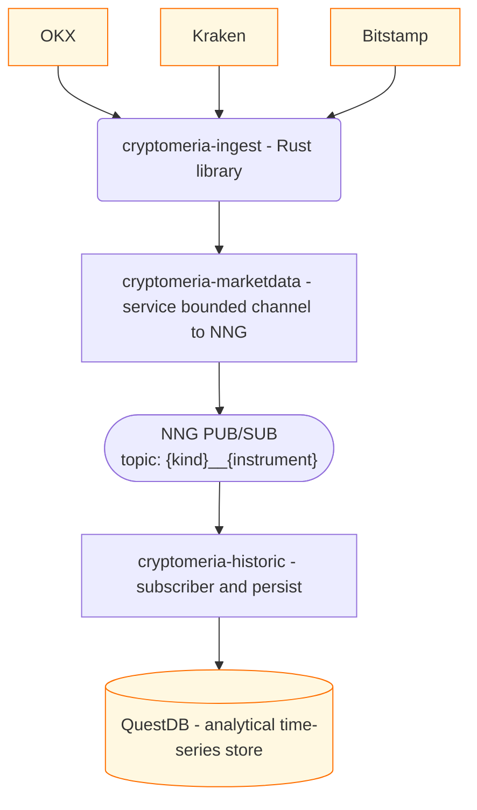

# Fibonsai

> Smart money finally grows on trees.

Open-source infrastructure for intelligent trading — built around
[algorithms](https://en.wikipedia.org/wiki/Algorithm) and
[machine learning](https://en.wikipedia.org/wiki/Machine_learning).

We conduct educational activities and publish news on intelligent bots,
automated strategies, and AI agents for portfolio management.

-   **[Cryptomeria](#projects)** — a production-grade market-data pipeline
    written in [Rust](https://www.rust-lang.org/)
-   **[License](#license)** — everything is Apache-2.0

---

## Projects

Cryptomeria is a three-stage pipeline that turns raw exchange feeds into an
analytical time-series store.

| Project | Stage | Description |
| :--- | :--- | :--- |
| [`cryptomeria-ingest`](https://github.com/fibonsai/cryptomeria-ingest) | Ingest | Multi-exchange WebSocket library (OKX, Kraken, Bitstamp) returning normalized `LOB` and `Trade` streams. |
| [`cryptomeria-marketdata`](https://github.com/fibonsai/cryptomeria-marketdata) | Broker | Service that subscribes to `cryptomeria-ingest`, fans out multiple exchanges in parallel, and publishes normalized events over an NNG TCP pub/sub broker. |
| [`cryptomeria-historic`](https://github.com/fibonsai/cryptomeria-historic) | Store | NNG subscriber that deserializes the events and persists them into [QuestDB](https://questdb.io) with embedded schema migrations. |

### Architecture



Each `cryptomeria-*` crate is independently versioned, licensed, and
documented. They share a common `MarketDataItem` data model so that items
flow from ingest to store without translation loss.

### Feature matrix

| Feature | `cryptomeria-ingest` | `cryptomeria-marketdata` | `cryptomeria-historic` |
| :--- | :---: | :---: | :---: |
| OKX / Kraken / Bitstamp | ✅ | ✅ | ✅ |
| Normalized LOB + Trade | ✅ | ✅ | ✅ |
| Automatic reconnect (backoff + jitter) | ✅ | ✅ | — |
| NNG pub/sub topic routing | — | ✅ | ✅ (sub) |
| Schema migrations | — | — | ✅ (V1 `trades`, V2 `lob_levels`) |
| Dry-run / test-timeout for CI | ✅ | ✅ | ✅ |

---

## Quick start

The fastest path to a full pipeline is to run every stage in `cargo`:

```bash
# 1. Run QuestDB (e.g. via Docker)
docker run -d -p 9000:9000 questdb/questdb

# 2. Clone and build the whole stack
git clone https://github.com/fibonsai/cryptomeria-ingest
git clone https://github.com/fibonsai/cryptomeria-marketdata
git clone https://github.com/fibonsai/cryptomeria-historic
cargo build --release -p cryptomeria-ingest -p cryptomeria-marketdata -p cryptomeria-historic

# 3. Run marketdata (ingests + re-broadcasts)
./target/release/marketdata --config cryptomeria-marketdata/config.toml

# 4. Run historic (consumes + persists)
./target/release/cryptomeria-historic

# 5. Subscribe from any NNG client
nngcat -sub -t "lob__*" tcp://127.0.0.1:14242
```

See each project's own `README.md` for full API reference, configuration, and
CLI options.

---

## Getting involved

We follow [Rust] idioms and a shared set of standards across all crates:

- **Async Rust**, `Tokio` + `Tokio-Tungstenite`
- **Apache-2.0** — contributions are licensed under the same
- **Zero task leaks** — streams abort their background tasks on drop
- **Tested + linted in CI** — `cargo test`, `cargo clippy -D warnings`, [`cargo-audit`](https://github.com/RustSec/cargo-audit)

| Resource | Link |
| :--- | :--- |
| Code of conduct | [CONTRIBUTING.md](https://github.com/fibonsai/cryptomeria-ingest/blob/main/CODE_OF_CONDUCT.md) |
| How to contribute | [CONTRIBUTING.md](https://github.com/fibonsai/cryptomeria-ingest/blob/main/CONTRIBUTING.md) |
| Report a vulnerability | [SECURITY.md](https://github.com/fibonsai/cryptomeria-ingest/blob/main/SECURITY.md) |
| Development guide | [AGENTS.md](https://github.com/fibonsai/cryptomeria-ingest/blob/main/AGENTS.md) |

[Rust]: https://www.rust-lang.org/

---

## License

All projects are licensed under the **Apache License 2.0** — see each crate's
[`LICENSE`](https://github.com/fibonsai/cryptomeria-ingest/blob/main/LICENSE).
